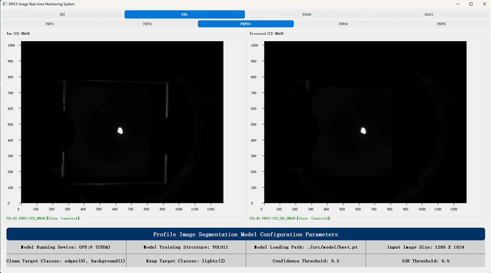
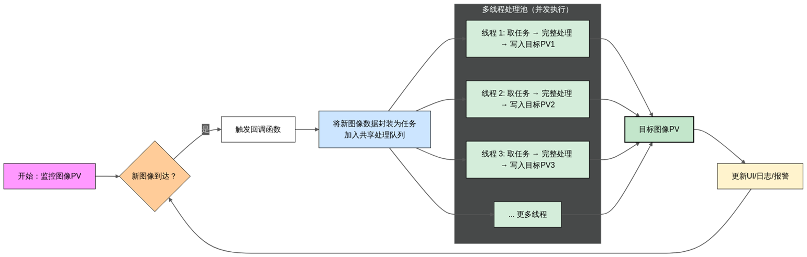

# Epics_Profile_Image_Denosier

## 电子束图像分割去噪软件

> Update Dates: 2025/11/18

> Contributers: Palette25

> Institution: IASF, ShenZhen

### 主要功能:
1. 结合YOLO11实例分割模型，将电子束中非关注的靶边缘成像区域进行去除。
2. 对电子束Profile图像进行背景去噪，优化视觉图像的整体效果，有助于调束人员进行清晰可辨的束流诊断。
3. 提供可视化界面，进行图像处理前后的实时对比。

 </img>

### 改进：
1. 持续优化图像实例分割模型效果，通过真实场景下的采集图像与标注优化模型分割的准确率指标。
2. 在多PV场景下加入多线程处理逻辑，同时对不同PV图像进行监控和实时处理。

 </img>